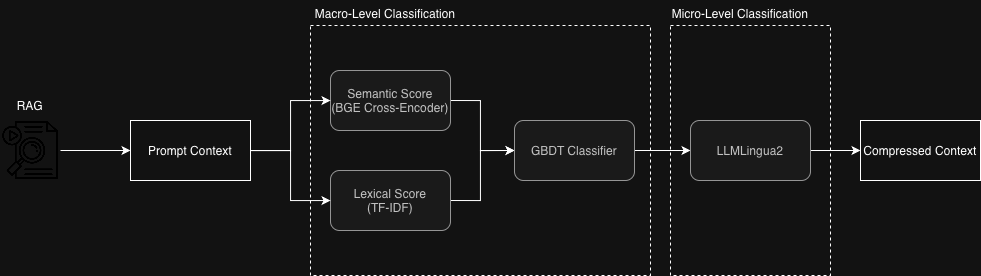

# HCC — Hybrid Context Compressor

> Query-aware context compression for LLM prompts.  
> Reduces token usage while preserving the information relevant to answering the query.

---



---

## How it works

HCC compresses a *(context, question)* pair through a 2-stage pipeline:

1. **Macro-Level** — Scores each sentence from context based on the query with 2 methods, extracts features, and runns them throung a XGB Classifier
2. **Micro-Level(LLMLingua2)** — removes redundant tokens from the surviving sentences

The compressed context is then forwarded to any LLM backend (default: Ollama).

---

## Installation

```bash
git clone https://github.com/<your-username>/hcc.git
cd hcc

python -m venv .venv && source .venv/bin/activate
pip install -r requirements.txt

cp .env.example .env   
```

**Prerequisites:** Python ≥ 3.10 · [Ollama](https://ollama.com/) running locally

---

## API

Start the server:

```bash
uvicorn hcc.api.app:app --port 8080
```

Docs available at `http://localhost:8080/docs`.

### `POST /compress` — compression only

Returns the compressed context. Can be sent to any LLM.

```bash
curl -X POST http://localhost:8080/compress \
  -H "Content-Type: application/json" \
  -d '{"question": "Who wrote Hamlet?", "context": "Hamlet is a tragedy written by William Shakespeare..."}'
```

```json
{
  "compressed_text": "Hamlet tragedy written William Shakespeare.",
  "original_tokens": 312,
  "compressed_tokens": 9,
  "compression_ratio": 4.2,
  "compression_latency_ms": 820
}
```

### `POST /compress-and-predict` — compression + LLM answer

Requires Ollama running locally (configured in `.env`).

```bash
curl -X POST http://localhost:8080/compress-and-predict \
  -H "Content-Type: application/json" \
  -d '{"question": "Who wrote Hamlet?", "context": "Hamlet is a tragedy written by William Shakespeare..."}'
```

```json
{
  "compressed_text": "Hamlet tragedy written William Shakespeare.",
  "original_tokens": 312,
  "compressed_tokens": 9,
  "compression_ratio": 4.2,
  "compression_latency_ms": 820,
  "llm_response": "William Shakespeare wrote Hamlet.",
  "llm_latency_ms": 540
}
```

### `GET /health`

```json
{ "status": "ok", "model_loaded": true }
```

---

## Project structure

```
hcc/
├── api/                  # FastAPI app
├── core/                 # Compression pipeline modules
├── db/                   # DB connection & operations
├── data/                 # XGBoost model weights
├── runner.py             # Bulk evaluation
├── requirements.txt
└── .env.example
```

> `runner.py` is an optional research tool for running experiments on a dataset stored in PostgreSQL. It is **not required** to use the API.
